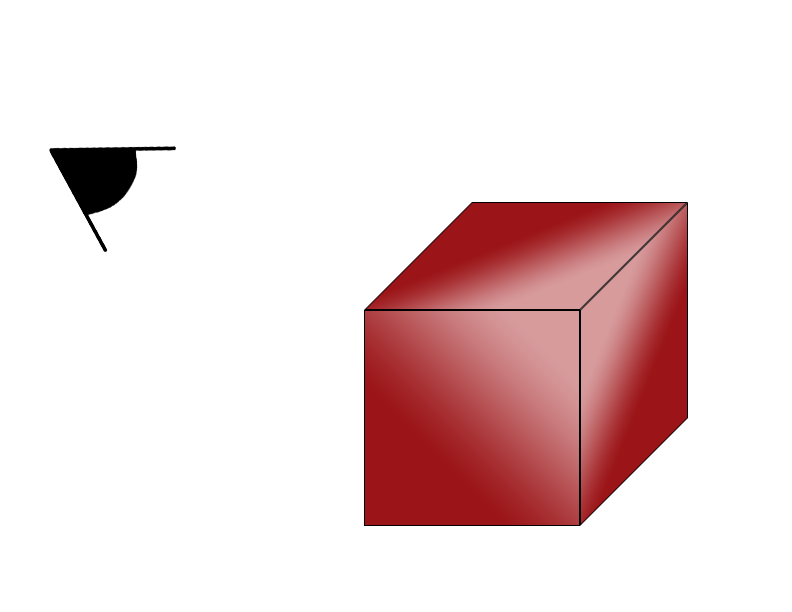

# Game-Engine Assisted Research framework for Scientific computing (GEARS) in Virtual Reality

    

-----------------

## Summary
The recent widespread availability of commodity head-mounted displays (HMDs) has fueled a virtual reality (VR) renaissance in several entertainment and media industries. This resurgence has produced a number of enabling technologies, both hardware and software, that reduce the barrier to entry for new applications of VR. In an effort to leverage these advantages for scientific computing, in this report, we provide a workflow for use with game engines to adapt visualization and simulation techniques for VR. This framework accommodates multiple programming languages and game engines. These game engines provide unique advantages over other tools, like automatic control mappings, that make it more approachable for non-specialists. As part of this framework, we present a hardware-agnostic platform, based on LAMMPS, that allows researchers to directly port existing codebases to VR using familiar programming languages. Additionally, we present a number of software tools that take advantage of VR’s enhanced functionality for scientific computing. To demonstrate the effectiveness of these systems, we review several use cases that range from visualizing the results of simulations carried out on high-performance computing clusters (HPCCs) to running scientific computing code from within the visualization. Building off our previous work on the subject, we first implement a real-time VR simulation of biological electron transfer (ET) in cytochrome proteins. We then outline the inclusion and optimization of LAMMPS for use in VR. These optimizations, which include the use of multiple cores through OpenMP, allow for real-time simulation sizes reaching 500,000 particles. Lastly, we demonstrate the unique power of immersive visualization by develop new VR-specific tools to enhance these simulations, including a shader that acts as a virtual confocal microscope. We apply this virtual scope to exam a molecular model of a desalination membrane.

Here we provide two flavors of GEARS, one utilizing the Unity game engine and another utilizing the Unreal Engine. Although both engines share many common features, they each have their strengths and weaknesses. Therefore, the platform on which one should build their VR visualzation tool depends on their nature of their research. Through the use cases below, we hope to provide a good overview of what these engines are capable of and how it could benefit the scientific computing community.

**For more information on each use of GEARS, including the system requirements, refer to the READMEs in the engines' respective directories.**

## Unity GEARS
### Sample Use Cases
1. VR Post-process Data Viewing Interface

   Here we provide a simple example of viewing pre-computed data from a simulation in VR. By converting our simulation data into a 3D simplicial complex, and integrating Leap Motion technology, one can grab hold of their data with their own hands. They can translate, rotate, and scale their data mesh using the unconstrained, intuitive movement of their own hands. Think Minority Report.

   

2. Virtual Confocal Microscopy

   While visualizing data in VR alone does provide a more immersive viewing experience, it does not necessarily tap into the unique tools only accessible in VR. To display the powerful immersiveness that VR provides, we developed a graphics shader based confocal microscopy system that allows users to scan through different viewing planes of large complex structures. Users can isolate sequestered regions in their data using head movement alone, a feature only possible with VR.

      

 

3. Real-time Simulator in Virtual Reality

   This demo consists of two parts, both hilighting the engines' capabilities of not only viewing precomputed data, but actually running simulations in real time. By translating existing code into the native language of Unity, C#, we provide the user real-time examples of a kinetic Monte Carlo and molecular dynamics based simulations. 

     Insert image of KMC or Lennard Jones

 

## Unreal GEARS
### Sample Use Cases
1. LAMMPS Integrated Simulator

   Using GEARS in Unreal Engine 4.16, we took our real-time simulation method one step further and integrated a pre-existing molecular dynamics library. Now, instead of translating simulation code to the native language of the engines, one can simply reuse their existing script and port it directly into the engine. By using the LAMMPS library, any simulation that uses a LAMMPS script can be run and visualized in real-time in our demo of GEARS in Unreal.

     

 

2. LAMMPS Integrated Playback Engine

   Because the LAMMPS library can also reconstruct simulation data via LAMMPS "DUMP" files, one can also use this integrated simulator to visualize a playback of any precomputed multi-scale simulation. We demo this by recreating a 100,000 particle simulation via LAMMPS, which one can view through their VR HMD. Using a set of motion controllers (from either Oculus or HTC), one can maneuver through the particles, viewing the giant structure from any angle they desire.

     

 

## Requested Features
1. *Data Feedback Support*
   In our real time simulations in Unreal GEARS, LAMMPS is essentially doing all the work aside from rendering. Right now, the only data we extract from LAMMPS are the particle positions and types. However, LAMMPS is capable of supplying much more, including system temperature, energy, etc. Having a live feedback of these simulation properties for the user would be incredibly benefical for GEARS as a visualization tool.
2. *Multi-User Support*
   As of right now, Unity and Unreal GEARS only support single user immersion into a simulation or data viewing session. It would be great to have multiple users be able to wear a head set and observe the same GEARS session. A researcher in Los Angeles and another in New York could theoretically observe the same simulation in real time, providing simultaneous input and analysis of the results.
3. *More Development for the Interactive Simulation*
   Although we've demo'd the ability to speed up, slow down, and pause a real time simulations in Unity and Unreal GEARS, further interactive support would also e incredibly beneficial to the utility of GEARS. Allowing a user to pause the simulation, take hold of one or more particles, and move or insert them elsewhere would make GEARS an even more powerful experimental visualization tool.
4. *Visible Bonds in Unreal GEARS with LAMMPS*
   There is no mechanism for calculating and visualizing where bonds occur between particles in the Unreal LAMMPS simulations.
	    
## Known Issues
* Making illegal/invalid LAMMPS calls in the LAMMPS input script will cause the engine to freeze
* OpenMP support in the LAMMPS input script only works when utilizing all the cores available on the machine. Only utilizing a fraction of the cores has been shown to cause the engine to crash.
* The billboards in Unreal GEARS rotate about the bottom center of the square. It would be better for them to rotate about the actual center of the billboard. This issue is more noticable when many particles are in close proximity.

## License

This project is licensed under the GPU 3.0 license - see the [LICENSE.md](LICENSE.md) file for details

## How to cite
