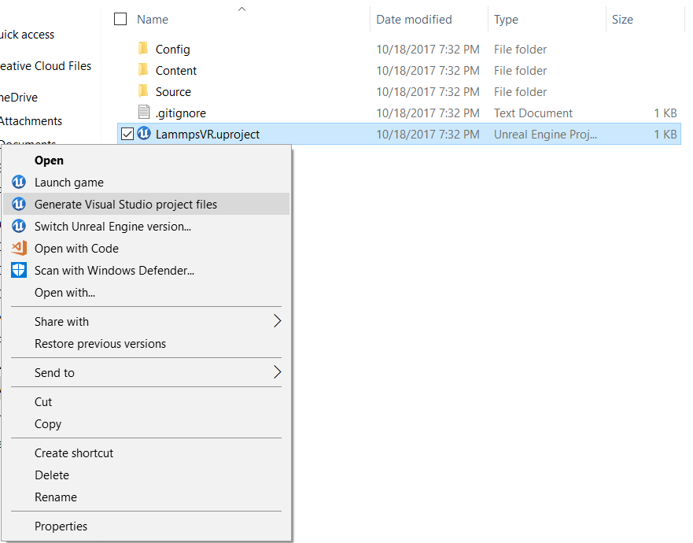

# GEARS in Unreal Engine 4.16

## System Requirements
* [Windows 10 OS](https://www.microsoft.com/en-us/windows/) (64-bit Version Recommended)
* [Unreal Engine 4.16](https://www.unrealengine.com/en-US/what-is-unreal-engine-4)
* Virtual Reality Head Mounted Display (only need one)
  1. [HTC Vive](https://www.vive.com/) with Motion Controllers
  2. [Oculus Rift](https://www.oculus.com/) with Oculus Touch
  * *Note: Respective runtimes and supporting software for the HMDs are also required*

## Installation
1. Install the Epic Games Launcher and Unreal Engine 4 from the [Epic Games](https://www.unrealengine.com/what-is-unreal-engine-4) website. The current project was developed in version 4.16.
2. For VR mode, install the appropriate runtime for your HMD of choice:
  * [Oculus Rift](https://www3.oculus.com/en-us/setup/)
  * [HTC Vive](https://www.vive.com/us/setup/)
3. Generate Visual Studio files by right clicking the Unreal project file (LammpsVR.uproject) in the LammpsEditor directory.

<div align="center" style="width : 80%; margin : auto">
     
</div><br>

  *If your computer does not associate .uproject files with the Unreal Editor, then you may have to open up the .uproject file via the Epic Games Launcher first.*

## Editor Overview ([Unreal Level Editor](https://docs.unrealengine.com/latest/INT/Engine/UI/LevelEditor/index.html))

<div align="center" style="width : 80%; margin : auto">
     
</div><br>

1. [Viewport](https://docs.unrealengine.com/latest/INT/Engine/UI/LevelEditor/Viewports/index.html)

  This is your means of previewing the virtual environment in which your LAMMPS simulation will run. When selected, a level will appear in this window. You can then place objects in the environment or fly around with the mouse and arrow keys. Objects in the currently selected level appear in the World Outliner window (3).

2. [Content Browser](https://docs.unrealengine.com/latest/INT/Engine/Content/index.html)

  This is the file explorer for C++ files, Unreal Blueprints, Materials, etc. associated with your project and/or simulation. Make sure any LAMMPS related resources (e.g. input scripts, data/dump files) are here in the Content/LammpsResource/ folder.

3. [World Outliner](https://docs.unrealengine.com/latest/INT/Engine/UI/LevelEditor/SceneOutliner/index.html)

  This is the list of objects/Blueprints in the currently selected level (this level is previewed in the Viewport).

4. [Details](https://docs.unrealengine.com/latest/INT/Engine/UI/LevelEditor/Details/index.html)

  This window describes the details of a selected item in the World Outliner window (3). When a LammpsController Blueprint in the current level is selected, this is where you can edit the input LAMMPS script, LAMMPS animation specifics (e.g. initial time step, animation step size), and the target LAMMPS dll that runs each simulation step.

## How to use LammpsVR Editor
1. Real-time Simulation Mode
  1. Make a new level
  2. From Blueprints/Simulation, drag the BP_LammpsController blueprint class into the level editor preview window (setting to the origin works fine).
  3. Setup the BP_LammpsController (via the Details window in the Unreal Editor):
	* LAMMPS Dll and Input Script
	  1. Specify the dll you wish to use under the "Dll Name" parameter in the "Lammps" Category. The dll must be located in the LammpsEditor/Content/LammpsResource/LammpsDll/ directory.
	  2. Specify the LAMMPS input script for the simulation in the "Input Script" parameter under the "Lammps" category. This script must be located in the LammpsEditor/Content/LammpsResource/Scripts/ directory.
	  3. Choose either Simulation Mode or Animation Mode
		1. Simulation Mode
		  Make sure that the "Animation Mode" box is unchecked.
		2. Animation Mode
		  Check the box label "Animation Mode". You will then need to specify which time steps to visualize based on LAMMPS dump files. LAMMPS dump files must be located in the Content/LammpsResource/LammpsDump/ directory. Dump filename must start with a prefix that you specify, followed by a "." and the time step number. Each dump file should only contain the state of a single time step. Example: "fracture.1234567.dump". Prefix, starting time step, final time step, and animation time step intervals can be specified under the "Animation" category in the BP_LammpsController Details window.
	* Particle Colors and Radii
	  By default, a particle visualization manager will assign a fixed particle radius and random color to all particle types in the LAMMPS instance. However, if you would like to customize the radii and color of your particles, you can edit them under the "Particle Management" category in the Details windows of the Unreal Editor. To customize:
	  1. Select the "+" sign next to the "Particles" parameter under the "Particle Management" category to add a new particle type to provide a custom color and radius for a new particle
	  2. Specify the particle's LAMMPS type number, radius (in atomic units), and color.

3. Default User Controller Setup:
  1. Drag a player spawning point into the editor preview window. The blueprint for this can be found in the Modes window of the Unreal Editor.
  2. In the World Settings windows of the Unreal Editor, set the "GameMode Override" paramter to BP_VRGameMode. Then under "Selected GameMode", set the "Default Pawn Class" to "BP_VRPawn"
  3. If you would like to create your own player controller, then this step is not necessary.

4. LAMMPS Input Script Rules:
  * The current working directory gets set to the LammpsVR/Content/LammpsResource/. Therefore, if a LAMMPS input script references another file, the path to that file must start from the LammpsResource directory.
  * LAMMPS commands that are not compatible with the compiled DLL will cause the LAMMPS instance to freeze or crash. For example, MPI is not included in our provided DLL. Therefore, if a LAMMPS input script makes use of the "processor" command, the engine will crash. The engine also freezes in instances where the LAMMPS input script references a file that does not exits. Therefore, always double check your path names.
  * For animation mode, the LAMMPSinput script must setup the LAMMPS system before running. Because the animation mode does not actually use any of the force calculations, dummy values for the system intial paramters can be used. For example, one can setup the animation system in their LAMMPS input script via the following LAMMPS commands:
  ```
  boundary  p p p
  atom_style atomic
  read_data path/to/sim/data/file.data
  pair_style  zero 5.0
  pair_coeff  * *
  mass 1 1.0
  mass 2 1.0
  mass 3 1.0
  mass 4 1.0
  thermo_style custom step temp etotal
  thermo 1
  ```

### Demo 1: Real-time Simulations
For this demo, we display the real time simulation capabilities of GEARS. In the Content/Levels/Demo1/ directory, you'll find several samples levels each of which is running a different LAMMPS simulation. Through these data sets you will see the various LAMMPS commands that the system is able to handle as well.

* The first example is a basic Lennard Jones molecular dynamics simulation, where all particles are of a single type.
* The second example is a simulation of Nano-porous Silica. In this example, the initial configuration is set via a separate .data file and the Vashishta pairstyle is utilized in the simulation.
* The third example simulates chemical vapor deposition, using both an initial configuration, pair style, and reaxff force field package compiled into our LAMMPS Dll.

### Demo 2: Animation
Fracture = rerunning precomputed dump files
