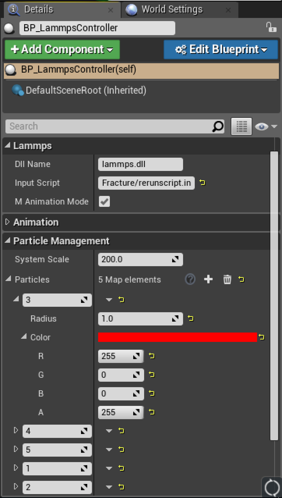

# GEARS in Unreal Engine 4.16 (with LAMMPS)

<div align="center">
     
</div>

## Overview

In Unreal GEARS, we showed how one can adapt existing code to run real time simulations in virtual reality. With this instance of GEARS, we move past that tedious and error-prone process, and instead integrate the popular molecular dynamics library, [LAMMPS](http://lammps.sandia.gov/), developed by [Sandia National Laboratories](http://www.sandia.gov/). Using our platform, one can run both real time and precomputed LAMMPS simulations in virtual reality. With minimal to no coding, a user can provide their own LAMMPS input script, select the sizes and colors of the particles using our GUI tool, then simply press play to watch it execute in VR.

## System Requirements
* [Windows 10 OS](https://www.microsoft.com/en-us/windows/) (64-bit Version Recommended)
* [Unreal Engine 4.16](https://www.unrealengine.com/en-US/what-is-unreal-engine-4)
* Virtual Reality Head Mounted Display (only need one)
  1. [HTC Vive](https://www.vive.com/) with Motion Controllers
  2. [Oculus Rift](https://www.oculus.com/) with Oculus Touch
  * *Note: Respective runtimes and supporting software for the HMDs are also required*

## Installation
1. Install the Epic Games Launcher and Unreal Engine 4 from the [Epic Games](https://www.unrealengine.com/what-is-unreal-engine-4) website. The current project was developed in version 4.16.
2. For VR mode, install the appropriate runtime for your HMD of choice:
  * [Oculus Rift](https://www3.oculus.com/en-us/setup/)
  * [HTC Vive](https://www.vive.com/us/setup/)
3. Generate Visual Studio files by right clicking the Unreal project file (LammpsVR.uproject) in the LammpsEditor directory.

<div align="center">
     
</div><br>

  *If your computer does not associate .uproject files with the Unreal Editor, then you may have to open up the .uproject file via the Epic Games Launcher first.*

## Editor Overview ([Unreal Level Editor](https://docs.unrealengine.com/latest/INT/Engine/UI/LevelEditor/index.html))

<div align="center">
     
</div><br>

1. [Viewport](https://docs.unrealengine.com/latest/INT/Engine/UI/LevelEditor/Viewports/index.html)

  This is your means of previewing the virtual environment in which your LAMMPS simulation will run. When selected, a level will appear in this window. You can then place objects in the environment or fly around with the mouse and arrow keys. Objects in the currently selected level appear in the World Outliner window (3).

2. [Content Browser](https://docs.unrealengine.com/latest/INT/Engine/Content/index.html)

  This is the file explorer for C++ files, Unreal Blueprints, Materials, etc. associated with your project and/or simulation. Make sure any LAMMPS related resources (e.g. input scripts, data/dump files) are here in the Content/LammpsResource/ folder.

3. [World Outliner](https://docs.unrealengine.com/latest/INT/Engine/UI/LevelEditor/SceneOutliner/index.html)

  This is the list of objects/Blueprints in the currently selected level (this level is previewed in the Viewport).

4. [Details](https://docs.unrealengine.com/latest/INT/Engine/UI/LevelEditor/Details/index.html)

  This window describes the details of a selected item in the World Outliner window (3). When a LammpsController Blueprint in the current level is selected, this is where you can edit the input LAMMPS script, LAMMPS animation specifics (e.g. initial time step, animation step size), and the target LAMMPS dll that runs each simulation step.

## How to use LammpsVR Editor
1. Make sure VR equipment (e.g. Headset, Controllers) is plugged into device and running.
2. Start LammpsVR.uproject using Unreal Editor 4.16
3. In the **Content Browser**, go to Levels/Demo1-RealtimeSim/ for real time simulation demos. Or, go to Levels/Demo2-Animation/ for rerun animations of precomputed simulations.
4. Select desired level by double clicking the icon.
5. Press the "Play - VR Preview" option in the top window.
6. Put on headset.
7. Enjoy :)

### Controls:
  Using motion controller, point green laser in direction that you want to move. Press either the right or left trigger buttons on the motion controllers to move forward in the direction that the green laser is pointing to.

  To pause the simulation (whether real time or animation), press one of the face buttons on the motion controller (for HTC Vive motion controllers, this is restricted to the circular directional pad on the front).

  To exit your current level, press the ESC key on the keyboard.

### How to customize LammpsVR levels

  Perhaps you would like to put your own simulation in the LammpsVR editor, and watch it for yourself. To do that,

  1. Prepare a LAMMPS script for your simulation and add ```run 0``` to the end of it.
  2. Place it in the LammpsResource/Scripts/ directory. If the LAMMPS script references other data files, be sure to include them at their proper relative locations.
  
      *Some LAMMPS commands may not work depending on what they do. For example, if the LAMMPS command requires a specific amount of CPUs, or references an MPI related command for example, they could cause the simulation to stall. Refer to the LAMMPS script we have provided for all tested LAMMPS commands.*

  3. Select a demo level as before, then select the BP_LammpsController in the **World Outlier** window. Go to its details in the **Details** window (pictured below).

  <div align="center">
       
  </div><br>

  4. Fill out the *Lammps*, *Animation*, and *Particle Management* sections in the window with references to your custom LAMMPS scripts withing the LammpsResource/ directory. This includes file paths, particle number to size and color associations, and even a choice to turn on animation mode. If animation mode is selected, be sure to include details about the animations time step files in the *Animation* section. All time step files must be in the LAMMPS DUMMP format. Additionally, the input script needs to be set up in a particular way. We will post a guide to this soon, so for now refer to our LAMMPS script, *LammpsResource/Scripts/Fracture/rerunscript.in*, as an example.

  5. Press Play.

### Extra LAMMPS Input Script Rules reiterated:
  * The current working directory gets set to the LammpsVR/Content/LammpsResource/. Therefore, if a LAMMPS input script references another file, the path to that file must start from the LammpsResource directory.
  * LAMMPS commands that are not compatible with the compiled DLL will cause the LAMMPS instance to freeze or crash. For example, MPI is not included in our provided DLL. Therefore, if a LAMMPS input script makes use of the "processor" command, the engine will crash. The engine also freezes in instances where the LAMMPS input script references a file that does not exits. Therefore, always double check your path names.
  * For animation mode, the LAMMPS input script must setup the LAMMPS system before running. Because the animation mode does not actually use any of the force calculations, dummy values for the system initial parameters can be used. For example, one can setup the animation system in their LAMMPS input script via the following LAMMPS commands:
  ```
  boundary  p p p
  atom_style atomic
  read_data path/to/sim/data/file.data
  pair_style  zero 5.0
  pair_coeff  * *
  mass 1 1.0
  mass 2 1.0
  mass 3 1.0
  mass 4 1.0
  thermo_style custom step temp etotal
  thermo 1
  ```

### Demo 1: Real-time Simulations
For this demo, we display the real time simulation capabilities of GEARS. In the Content/Levels/Demo1/ directory, you'll find several samples levels each of which is running a different LAMMPS simulation. Through these data sets you will see the various LAMMPS commands that the system is able to handle as well.

* The first example is a basic Lennard Jones molecular dynamics simulation, where all particles are of a single type.
* The second example is a simulation of Nano-porous Silica. In this example, the initial configuration is set via a separate .data file and the Vashishta pairstyle is utilized in the simulation.
* The third example simulates chemical vapor deposition, using both an initial configuration, pair style, and reaxff force field package compiled into our LAMMPS Dll.

### Demo 2: Animation
For this demo, we show the capabilities of GEARS to rerun previously computed simulations, effectively acting as an simulation animator in virtual reality. Our demo runs several thousand time steps of a 100,000 particle simulation precomputed on the University of Southern California's high performance computing cluster.

Navigate to the FractureWorld level in the Contents windows, double click it, then press play. One can pause and unpause the animation by pressing the face buttons on their Oculus Touch or Vive Motion Controller.

### Code Architecture
To be added shortly.
